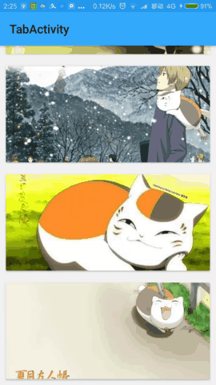
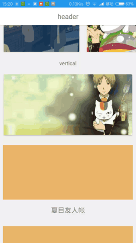

# PullRefreshLayout(A mall, bouncy, refresh, loadMore lib)
[](https://github.com/genius158/PullRefreshLayout)
[](https://bintray.com/yan157/maven/pullrefreshlayout/_latestVersion)
[](https://android-arsenal.com/api?level=14)
[](http://www.methodscount.com/?lib=com.yan%3Apullrefreshlayout%3A2.1.0)
### [DEMO DOWNLOAD(Install the demo and try, maybe PullRefreshLayout is that what you want)](https://github.com/genius158/PullRefreshLayout/raw/master/demo.apk)
Use with header and change state demo
<br/> 
 
 <br/> 
 
Secondary refresh
<br/>
 
 
<br/>

Nested Scroll
<br/>
 
 
 
<br/>

Refresh header show in scroll part [Detail](https://github.com/genius158/PullRefreshLayout/blob/master/CUSTOM_DIDI_README.md)
<br/>
 
 
<br/>

hold footer
<br/>
 
<br/>
 
fun header from https://github.com/scwang90/SmartRefreshLayout
<br/>
 
<br/>
 <br/>

  include ViewPager demo： https://github.com/genius158/PullRefreshLayout/blob/developer/app/src/main/java/com/yan/refreshloadlayouttest/testactivity/CommonActivity5.java
  <br/>
  <br/>
  include CoordinatorLayout demo：https://github.com/genius158/PullRefreshLayout/blob/developer/app/src/main/java/com/yan/refreshloadlayouttest/testactivity/ScrollingActivity.java
  <br/>

## 1.Summary
### 1.Main Features:
- 1.Perfect support synchronous NestedScrolling width RecyclerView、AppBarLayout、CoordinatorLayout.
- 2.Support all basic views(Include RecyclerView、NestedScrollView, TextView、ListView、ScrollerView、webView、LinearLayout etc.)
- 3.Support cross-border rebound OverScroll animations is better than other libs.
- 4.The touch event dell like application Tencent QQ.
- 5.Support load more.
- 6.Support custom rebound animation interpolator, to achieve a variety of cool animation effects
- 7.Support preview in the Android Studio xml editor.
- etc.


### 2.You can custom header and footer to realize various functions（Auto trigger loading、Fixed header、Secondary refresh etc.），the ways header and footer dragging out (PLACEHOLDER、FOLLOW、PLACEHOLDER_FOLLOW、CENTER、PLACEHOLDER_CENTER、FOLLOW_CENTER、CENTER_FOLLOW、FOLLOW_PLACEHOLDER)。
ps:This design is to make the lib small enough

## gradle  [](https://github.com/genius158/PullRefreshLayout)  ↘
compile 'com.yan:pullrefreshlayout:(↖)'
<br/>
 
```
    <!-- xml setting , How to set header for target and how to set state view -->     
    <com.yan.pullrefreshlayout.PullRefreshLayout xmlns:android="http://schemas.android.com/apk/res/android"
        xmlns:app="http://schemas.android.com/apk/res-auto"
        android:id="@+id/refreshLayout"
        android:layout_width="match_parent"
        android:layout_height="match_parent"
        app:prl_targetId="@+id/recyclerView">
    
        <com.yan.refreshloadlayouttest.widget.NestedFrameLayout
            android:layout_width="match_parent"
            android:layout_height="match_parent">
    
            <androidx.recyclerview.widget.RecyclerView
                android:id="@id/recyclerView"
                android:layout_width="match_parent"
                android:layout_height="match_parent"
                android:background="#f1f1f1"
                android:overScrollMode="never" />
     
            <!-- header -->
            <androidx.cardview.widget.CardView
                android:layout_width="match_parent"
                android:layout_height="wrap_content">
    
                <TextView
                    android:layout_width="match_parent"
                    android:layout_height="46dp"
                    android:gravity="center"
                    android:text="header"
                    android:textSize="18sp" />
            </androidx.cardview.widget.CardView>
    
            <!-- state view -->
            <TextView
                android:id="@+id/no_data"
                android:background="#ffffff"
                android:gravity="center"
                android:layout_width="match_parent"
                android:layout_height="match_parent"
                android:textColor="#212121"
                android:textSize="20sp"
                android:text="no data click to try again"  />
        </com.yan.refreshloadlayouttest.widget.NestedFrameLayout>
    
    </com.yan.pullrefreshlayout.PullRefreshLayout>

```
 
## 2. FAQ(Have any questions，commit issues) 

## 3. the libs demo is using
 loading animation
 <br/>
 AVLoadingIndicatorView(https://github.com/81813780/AVLoadingIndicatorView)


## LICENSE

    Copyright 2017 yan

    Licensed under the Apache License, Version 2.0 (the "License");
    you may not use this file except in compliance with the License.
    You may obtain a copy of the License at

        http://www.apache.org/licenses/LICENSE-2.0

    Unless required by applicable law or agreed to in writing, software
    distributed under the License is distributed on an "AS IS" BASIS,
    WITHOUT WARRANTIES OR CONDITIONS OF ANY KIND, either express or implied.
    See the License for the specific language governing permissions and
    limitations under the License.
