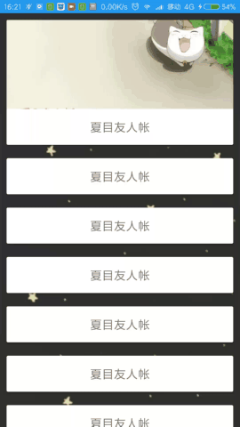
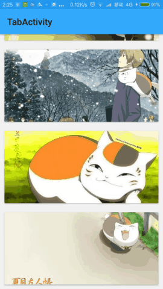
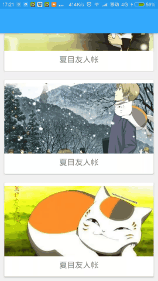
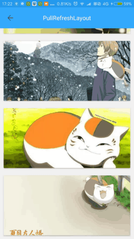
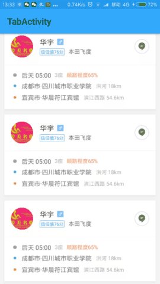
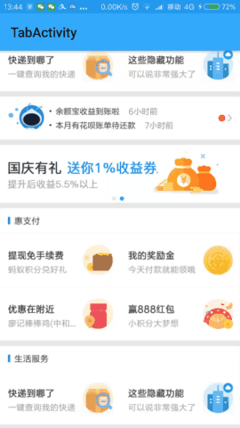
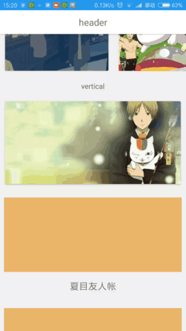

# PullRefreshLayout(这是一个专注回弹和手势操作无阻塞的刷新库，而且够小)
由于SDK 26.1.0各种兼容库在API14以下都已经不再适配了，相关的兼容方法,兼容的class都已经被废弃了，甚至MD也只支持API14以上，可见google已经测底放弃了android4.0以下的设备，
所以跟随google大大的脚步，PullRefreshLayout也将MinSdk 上调到API14.
<br/>
[](https://github.com/genius158/PullRefreshLayout)
[](https://bintray.com/yan157/maven/pullrefreshlayout/_latestVersion)
[](https://android-arsenal.com/api?level=14)
[](http://www.methodscount.com/?lib=com.yan%3Apullrefreshlayout%3A2.1.0)
## [ENGLISH](ENGLISH_README.md)
### [DEMO下载(跑起来看一看，也许这就是你想要的效果！)](https://github.com/genius158/PullRefreshLayout/raw/master/demo.apk)
header和状态切换演示gif
<br/> 
 
 <br/> 
 
二级刷新
<br/>
 
 
<br/>

嵌套滑动
<br/>
 
 
 
<br/>

滴滴，支付宝刷新（看刷新的位置,不包括loading动画）[详情](https://github.com/genius158/PullRefreshLayout/blob/master/CUSTOM_DIDI_README.md)
<br/>
 
 
<br/>

加载更多，加载完成，保持footer
<br/>
 
<br/>
 
fun header 来自from https://github.com/scwang90/SmartRefreshLayout
<br/>
 
<br/>
<br/>

包裹ViewPager 参考： https://github.com/genius158/PullRefreshLayout/blob/developer/app/src/main/java/com/yan/refreshloadlayouttest/testactivity/CommonActivity5.java
 <br/>
 <br/>
 包裹CoordinatorLayout 参考：https://github.com/genius158/PullRefreshLayout/blob/master/app/src/main/java/com/yan/refreshloadlayouttest/testactivity/ScrollingActivity.java
 <br/>

## 1.概述
#### 本库的主要特点:完美契合嵌套滑动，和与其他回弹刷新库相比更加真实的回弹效果、即使控件不可滑动,也有惯性缓冲效果(ps:如何触发——比如下拉到一定距离不放，往回滑动，即可看到效果),切换状态见NestedActivity
1.对所有基础控件(包括，嵌套滑动例如RecyclerView、NestedScrollView，普通的TextView、ListView、ScrollerView、webView、LinearLayout等)提供下拉刷新、上拉加载的支持
，且实现无痕过度，和与其他库相比更真实的回弹效果(（即使不是滑动控件）也有惯性缓冲效果)。
#### 2.本库的主旨就是一切功能皆由header或者footer实现，所以你可以自定义header和footer（实现任何你想的到的功能，自动触发加载更多、固定头部、自动触发刷新（不弹出header）、二级刷新等），header和footer拽出方式默认8种(PLACEHOLDER、FOLLOW、PLACEHOLDER_FOLLOW、CENTER、PLACEHOLDER_CENTER、FOLLOW_CENTER、CENTER_FOLLOW、FOLLOW_PLACEHOLDER)，动画可以onPullChange()完全自主设置。
ps:本库没有做解耦处理（那样会增加.class，大小也会增加），目的是使库足够小，而且本库功能目的明确，不必做无用功。

## gradle  [](https://github.com/genius158/PullRefreshLayout)  ↘
compile 'com.yan:pullrefreshlayout:(↖)'
<br/>
## 2.说明  
支持所有基础控件
<br/>
<br/>
 
```
//-控件设置-
    refreshLayout.autoRefresh();// 自动刷新
    refreshLayout.autoRefresh(ture);// 自动刷新,同时是否触发刷新回调
    refreshLayout.autoLoading();// 自动加载
    refreshLayout.autoLoading(ture);// 自动加载,同时是否触发加载回调
    
    refreshLayout.setOverScrollDampingRatio(0.35f);//  值越大overscroll衰减越小（如何运作：overscroll移动偏移量*0.35） default 0.35F
    refreshLayout.setScrollInterpolator(interpolator);// 设置scroller的插值器
    refreshLayout.setAnimationMainInterpolator(interpolator);// 除了回弹其他所有动画的插值器 default ViscousInterpolator
    refreshLayout.setAnimationOverScrollInterpolator(interpolator);// 回弹动画的插值器 default ViscousInterpolator
            
    refreshLayout.setOverScrollMinDuring(int during);// 设置overscroll最小时间 default 60
    refreshLayout.setRefreshAnimationDuring(int refreshAnimationDuring);// 触发刷新或加载动画的执行时间 default 180
    refreshLayout.setResetAnimationDuring(int resetAnimationDuring);// 触发界面回复的动画执行时间 default 400
    refreshLayout.setDragDampingRatio(0.6f);// 阻尼系数（如何运作：移动偏移量*0.6） default 0.6F
    
    refreshLayout.setOverScrollAdjustValue(1f);// 用于控制overscroll时间 default 1f ,越大overscroll的时间越长
    refreshLayout.setTopOverScrollMaxTriggerOffset(300);// 用于控制顶部的overscroll的距离 default 65dp
    refreshLayout.setBottomOverScrollMaxTriggerOffset(300);// 用于控制底部overscroll的距离 default 65dp
    refreshLayout.setPullUpMaxDistance(300);// 用于控制向上移动的最大距离(大于等于0,为0可模拟禁用底部回弹) 默认 控件高度
    refreshLayout.setPullDownMaxDistance(300);// 用于控制向下移动的最大距离(大于等于0,为0可模拟禁用顶部回弹) 默认 控件高度

    refreshLayout.setRefreshEnable(false);// 下拉刷新是否可用 default true
    refreshLayout.setLoadMoreEnable(true);// 上拉加载是否可用 default false
    refreshLayout.setTwinkEnable(true);// 回弹是否可用 default true 
    refreshLayout.setAutoLoadingEnable(true);// 自动加载是否可用 default false
     
    // headerView和footerView需实现PullRefreshLayout.OnPullListener接口调整状态
    refreshLayout.setHeaderView(headerView);// 设置headerView
    refreshLayout.setFooterView(footerView);// 设置footerView
    
    refreshLayout.isTwinkEnable();// 是否开启回弹
    refreshLayout.isRefreshEnable();// 是否开启刷新
    refreshLayout.isLoadMoreEnable();// 是否开启加载更多
    
    refreshLayout.isDragMoveTrendDown();// 是否处于向下移动的趋势
    
    refreshLayout.isDragUp();// 是否正在向上拖拽
    refreshLayout.isDragDown();// 是否正在向下拖拽
    refreshLayout.isRefreshing();// 是否正在刷新
    refreshLayout.isLoading();// 是否正在加载
    refreshLayout.isOverScrollDown();// 是否正在向下越界回弹
    refreshLayout.isOverScrollUp();// 是否正在向上越界回弹
    
    refreshLayout.isDragVertical();// 是否开始纵向拖拽
    refreshLayout.isDragHorizontal();// 是否开始横向拖拽
    refreshLayout.isLayoutDragMoved();// 刷新控件是否移动
    
    refreshLayout.isLayoutMoving();// prl是否正在移动（也就是判断有没有动画正在执行）

    refreshLayout.isHoldingTrigger();// 是否已经触发刷新或加载
    refreshLayout.isHoldingFinishTrigger();// 是否已经触发刷新完毕或加载完毕
     
    refreshLayout.getMoveDistance();// 得到refreshlayout的移动距离
    refreshLayout.getRefreshTriggerDistance();// 得到下拉刷新的触发距离
    refreshLayout.getLoadingTriggerDistance();// 得到上拉加载的触发距离
    refreshLayout.getPullUpLimitDistance();// 得到向上拖拽最大范围（最大距离）
    refreshLayout.getPullDownLimitDistance();// 得到向下拖拽最大范围（最大距离）
    refreshLayout.getHeaderView();// 得到headerView
    refreshLayout.getFooterView();// 得到FooterView
    refreshLayout.getTargetView();// 得到TargetView
    
    refreshLayout.setRefreshTriggerDistance(200);// 设置下拉刷新触发位置，默认为header的高度  
    refreshLayout.setLoadTriggerDistance(200);// 设置上拉加载触发位置，默认为footer的高度  
    refreshLayout.setPullUpLimitDistance(400);// 向上拖拽最大范围，默认控件高度
    refreshLayout.setPullDownLimitDistance(400);// 向下拖拽最大范围，默认控件高度

    refreshLayout.setTargetView(nestedScrollView);// 设置目标view，可以改变滑动判断
   
    refreshLayout.setDispatchTouchAble(true);// 是否分发部所有事件 default true
    refreshLayout.setDispatchPullTouchAble(false);// 是否分发pullrefreshLayout的默认事件 default true
    refreshLayout.setDispatchChildrenEventAble(false);// 是否分发子View的默认事件 default true
    refreshLayout.setFooterFront(true);// 设置footer前置 default false
    refreshLayout.setHeaderFront(true);// 设置header前置 default false
    refreshLayout.setMoveWithFooter(true);// 设置footer跟随移动 default true
    refreshLayout.setMoveWithContent(true);// 设置直接子view跟随移动 default true
    refreshLayout.setMoveWithHeader(true);// 设置header跟随移动 default true
 
    refreshLayout.cancelAllAnimation();//取消所有正在执行的动画
    refreshLayout.cancelTouchEvent();//主动执行ACTION_CANCEL事件
  
    refreshLayout.moveChildren(0);// 移动子view
    
    refreshLayout.requestPullDisallowInterceptTouchEvent();// touch事件交给子View
   
    refreshLayout.setOnDragIntercept(PullRefreshLayout.OnDragIntercept);// 设置滑动判定 见 BEHAIVOR2
    public static class OnDragIntercept {
        public boolean onHeaderDownIntercept() {// header下拉之前的拦截事件
            return true;// true将拦截子view的滑动
        }
        public boolean onFooterUpIntercept() {// footer上拉之前的拦截事件
            return true;// true将拦截子view的滑动
        }
    }
    
    /**
    * 设置header或者footer的的出现方式,默认8种方式
    * FOLLOW,FOLLOW_PLACEHOLDER, PLACEHOLDER_FOLLOW
    * , FOLLOW_CENTER, PLACEHOLDER_CENTER
    * , CENTER, CENTER_FOLLOW
    * , PLACEHOLDER
    */
    refreshLayout.setRefreshShowGravity(RefreshShowHelper.CENTER,RefreshShowHelper.CENTER);
    refreshLayout.setHeaderShowGravity(RefreshShowHelper.CENTER)// header拽出方式
    refreshLayout.setFooterShowGravity(RefreshShowHelper.CENTER)// footer拽出方式
    // PullRefreshLayout.OnPullListener
        public interface OnPullListener {
            // 刷新或加载过程中位置相刷新或加载触发位置的百分比，时刻调用
            void onPullChange(float percent);
            void onPullReset();// 数据重置调用
            void onPullHoldTrigger();// 拖拽超过触发位置调用
            void onPullHoldUnTrigger();// 拖拽回到触发位置之前调用
            void onPullHolding(); // 正在刷新
            void onPullFinish();// 刷新完成
        }
         
    <!-- xml setting -->     
    <com.yan.pullrefreshlayout.PullRefreshLayout xmlns:android="http://schemas.android.com/apk/res/android"
        app:prl_autoLoadingEnable="false"
        app:prl_dragDampingRatio="0.6"
        app:prl_resetAnimationDuring="400"
        app:prl_refreshAnimationDuring="180"
        app:prl_footerShowGravity="follow"
        app:prl_footerViewId="@layout/header_or_footer"
        app:prl_headerViewId="@layout/header_or_footer"
        app:prl_headerClass="com.yan.refreshloadlayouttest.widget.PlaceHolderHeader"
        app:prl_footerClass="com.yan.refreshloadlayouttest.widget.PlaceHolderHeader"
        app:prl_headerShowGravity="statePlaceholder"
        app:prl_loadMoreEnable="true"
        app:prl_loadTriggerDistance="70dp"
        app:prl_overScrollDampingRatio="0.2"
        app:prl_topOverScrollMaxTriggerOffset="65dp"
        app:prl_bottomOverScrollMaxTriggerOffset="70dp"
        app:prl_pullDownMaxDistance="150dp"
        app:prl_pullUpMaxDistance="250dp"
        app:prl_headerFront="true"
        app:prl_footerFront="true"
        app:prl_targetId="@+id/recyclerView"
        app:prl_refreshEnable="true"
        app:prl_refreshTriggerDistance="90dp"
        app:prl_overScrollAdjustValue="1"
        app:prl_twinkEnable="true">     
        
        <!-- 通过以下例子，你可以轻易实现recyclerView(任何View)的header，和数据错误、网络错误等的状态切换--> 
        <com.yan.pullrefreshlayout.PullRefreshLayout xmlns:android="http://schemas.android.com/apk/res/android"
            xmlns:app="http://schemas.android.com/apk/res-auto"
            android:id="@+id/refreshLayout"
            android:layout_width="match_parent"
            android:layout_height="match_parent"
            app:prl_targetId="@+id/recyclerView">
        
            <!-- 包装层，实现了嵌套滑动的功能，也可以是普通的FrameLayout(实现机制不同) -->
            <com.yan.refreshloadlayouttest.widget.NestedFrameLayout
                android:layout_width="match_parent"
                android:layout_height="match_parent">
        
                <!-- 数据添装 -->
                <androidx.recyclerview.widget.RecyclerView
                    android:id="@id/recyclerView"
                    android:layout_width="match_parent"
                    android:layout_height="match_parent"
                    android:background="#f1f1f1"
                    android:overScrollMode="never" />
         
                <!-- header -->
                <androidx.cardview.widget.CardView
                    android:layout_width="match_parent"
                    android:layout_height="wrap_content">
        
                    <TextView
                        android:layout_width="match_parent"
                        android:layout_height="46dp"
                        android:gravity="center"
                        android:text="header"
                        android:textSize="18sp" />
                </androidx.cardview.widget.CardView>
        
                <!-- 状态显示界面 -->
                <TextView
                    android:id="@+id/no_data"
                    android:background="#ffffff"
                    android:gravity="center"
                    android:layout_width="match_parent"
                    android:layout_height="match_parent"
                    android:textColor="#212121"
                    android:textSize="20sp"
                    android:text="no data click to try again"  />
            </com.yan.refreshloadlayouttest.widget.NestedFrameLayout>
        
        </com.yan.pullrefreshlayout.PullRefreshLayout>

```

## 3.版本说明
  
 version:1.7.3 ： 事件切换优化
 <br/>
 version:1.7.4 ： 一直处于触摸状态下的，执行setTargetView（）方法，增加cancel掉事件
 <br/>
 version:1.7.5 ： 修复事件状态错误问题
 <br/>
 version:1.7.8 ： 调整由于onStartNestedScroll()先于onNestedPreFling()执行的二次handleAction
 <br/>
 version:1.8.5 ： 优化flingBack效果 
 
 <br/>
 version:2.0.0 ： 新增SwipeRefreshLayout效果,优化
 <br/>
 version:2.0.2 ： 新增viewpager实例
 <br/>
 version:2.0.3 ： dragState 状态调整
 <br/>
 <br/>
 version:2.0.5 ： 使用粘性插值器
 <br/>
 version:2.0.7 ： 调整回弹插值器为线性插值器，回弹效果基本与qq一致
 <br/>
 version:2.0.9 ： 多点触控调整
 <br/>
 version:2.0.10 ： insert methods getHeaderView(),getFooterView),getTargetView()
 <br/>
 version:2.1.0 ： detail adjust
 <br/>
 version:2.2.1 ：add method autoRefresh(int toRefreshDistance),autoLoading(int toLoadDistance)
 <br/>
 version:2.2.2 ：修复回调时机错误问题
 <br/>
 version:2.2.4 ：剔除反射部分，恢复header划出的原本处理
 <br/>
 version:2.2.5 ：增加isTargetScrollUpAble和isTargetScrollDownAble拦截监听
 <br/>
 version:2.2.6 ：fix issue https://github.com/genius158/PullRefreshLayout/issues/25
 <br/>
 version:2.2.7 ：增强滑动体验 
 <br/>
 version:3.x ：androidx
 <br/>
 version:3.0.1 ：主动分发的事件，主动回收
 
## 4.问题 FAQ(对于本库的使用有问题，都可以在github上提issue，本人重度github控，一天最最少半小时泡在github上)
 1.VLayout 设置悬浮后，不可下拉（问题可见https://github.com/alibaba/vlayout/blob/master/docs/VLayoutFAQ.md）
 <br/>
 官方描述如下：
 <br/>
 下拉刷新，有很多框架是通过判断 RecyclerView 的第一个 view 的 top 是否为 0 来触发下拉动作。VLayout 里在处理背景、悬浮态的时候加入了一些对 LayoutManager 不可见的 View，但又真实存在与 RecyclerView 的视图树里，建议使用 layoutManager.getChildAt(0) 来获取第一个 view。
<br/>
<br/>
解决办法：可复写刷新判断
```
    @Override
    public boolean isTargetScrollUpAble() {
          ...  
```

<br/>
<br/>

友情提示： （ 来自[pjh520](https://github.com/pjh520)的的提点  ）如果你使用了scrollView，它的直接子View请不要设置纵向的margin会影响滑动判断，这点也是刷新库的通病。。。


## 5.demo用到的库
 loading 动画
 <br/>
 AVLoadingIndicatorView(https://github.com/81813780/AVLoadingIndicatorView)


## LICENSE

    Copyright 2017 yan

    Licensed under the Apache License, Version 2.0 (the "License");
    you may not use this file except in compliance with the License.
    You may obtain a copy of the License at

        http://www.apache.org/licenses/LICENSE-2.0

    Unless required by applicable law or agreed to in writing, software
    distributed under the License is distributed on an "AS IS" BASIS,
    WITHOUT WARRANTIES OR CONDITIONS OF ANY KIND, either express or implied.
    See the License for the specific language governing permissions and
    limitations under the License.
